Scratch tutorial: Grib mønterne!
================================
*af Sebastian Paaske Tørholm og Martin Dybdal*

I denne tutorial vil jeg forklare hvordan du kan lave dit helt eget Scratch spil, hvor man skal gribe det der falder ned! Du bestemmer selv hvad det er der skal falde ned, måske nogle tallerkener, der går i stykker når de rammer jorden? Eller æbler som falder ned fra træerne?

Start med at oprette en konto på [http://scratch.mit.edu](http://cratch.mit.edu/) hvis du ikke allerede har en. Ellers kan du ikke gemme dit spil til næste gang.

Hvis du får problemer mens du er derhjemme, så skriv et spørgsmål på Coding Pirates-forummet: [http://forum.codingpirates.dk/](http://forum.codingpirates.dk/) 

## Del 1: Få Scratch-katten til at bevæge sig

Først skal vi lære hvordan vi får Scratch-katten til at bevæge sig ved at bruge piletasterne.

### Vejledning

Klik først på fanebladet "Scripts":

Vælg "Hændelser":

Vælg denne brik og flyt den ind på kodeområdet (Scratch-katten’s "hjerne"):

og ændr den til "højre pil" ved at klikke på den sorte pil:

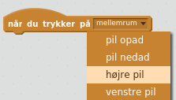

Kobl den sammen med denne brik:

Og så denne:

Sådan! Så burde du have:

Byg nu det samme igen, men denne gang skal katten gå til venstre:

Nogle kloge mennesker har fundet på at:

* -90 betyder venstre

* 90 betyder højre

Prøv spillet ved at trykke på det grønne flag: 

### Scratch vender på hovedet!

Hvis Scratch-katten vender på hovedet når du går til venstre:

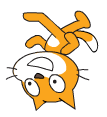

Så tilføj de her to brikker:

Du behøver ikke forstå hvorfor, bare gør det!

Sådan er det nogle gange at programmere, der er ting der er lidt skøre eller forvirrende, som man bare må leve med. (Vi vender tilbage, så lærer du det rigtigt senere.)

## Del 2: Baggrund

Det er lidt kedeligt at Scratch bare går rundt på en helt hvid baggrund. Find på en eller anden baggrund han kan gå på. Det kan være hjemme på dit værelse, ude i dit køkken, i et supermarked eller måske går han en tur udenfor!

### Vejledning

For at lave en baggrund skal du klikke her:

Og så her:

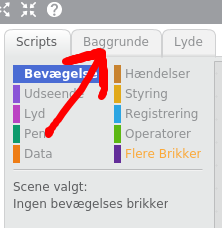

Den baggrund jeg har lavet, ser sådan her ud:

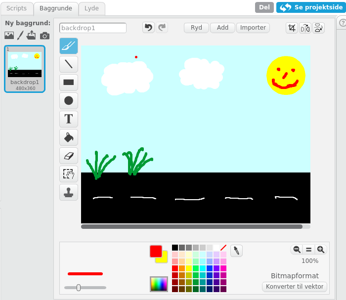

## Del 3: Lommepenge fra himlen!

Nu skal vi få noget til at falde ned fra himlen! I mit spil tænker jeg at det skal være nogle 5-krone mønter, men det kan også være frugter, oste, balloner, bomber eller noget helt andet! Hvis det foregår i køkkenet, så er det måske tallerkener der falder ud af skabene og går i stykker når de rammer jorden.

### Vejledning: Tegning

Først skal du oprette en ny figur ("sprite"). Tryk på penslen:

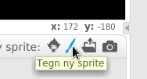

Tegn hvordan den skal se ud, her er min 5’er:

### Vejledning: Programmering

Lad os starte med at få mønten til at falde ned fra himlen!

For at gøre det, lad os bruge brikkerne vi kender, til at få mønten til at gå 10 skridt nedad:

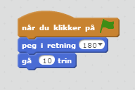

Men det får den kun til at gå ned en gang når vi starter spillet! Vi vil gerne have den til at blive ved med at gøre det!

Det vi kan gøre er, at sige at den skal blive ved med at gå nedad! Det gør vi med den her brik:

Vi kan trække den rundt om de brikker vi har, for at få den til blive ved med at gå ned! Sådan her!

Prøv så at køre programmet! (Du kan trække mønten op i top af skærmen, hvis den er i bunden, ellers sker der ikke noget!)

Del 4: Fang mønten

Nu vil vi gerne have katten til at kunne få fat i mønten! Det gør vi lidt modsat hvad man skulle tro: Vi får mønten til at se om den rører ved katten. (Det kommer til at give mening om lidt. Stol på mig!)

### Vejledning:

For at checke om vi rører ved noget skal vi bruge to brikker! Først skal vi bruge brikken der ser om vi rører ved noget! Den ligger her:

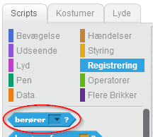

Vi skal sige hvad den skal checke om vi rør ved, så vi skal vælge katten fra listen i brikken:

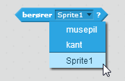

(Ja, katten hedder Sprite1. Det er fordi vi ikke har givet den et bedre navn endnu.)

Vi skal så bruge en brik der venter på at noget sker! Det er den her brik:

(Den ligger sammen med de andre gule brikker)

Lad os sætte dem sammen og se hvad der sker:

Hvad sker der så hvis vi sætter spillet i gang og rør ved mønten med katten?

Hov. Der sker jo ikke noget. Det er fordi vi ikke har bedt den om at gøre noget når det sker! Så lad os få den til at sige hej. Det gør vi med den her brik:

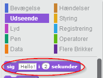

Lad os smide den ind efter de andre og se hvad der sker.

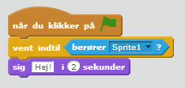

Prøv nu at køre programmet! Men hov. Den siger kun noget første gang katten rør den. Hvordan kan vi få den til at blive ved med at checke om katten rør?

Tænk lidt over det inden du kigger videre!

Vi kan gøre det samme som da mønten skulle blive ved med at falde ned!

## Del 5: Saml mønten op (og flyt den op i toppen så den falder ned igen)

Sådan! Men vi vil ikke have mønten til at sige hej! Vi vil gerne have katten til at tage mønten!

Måden vi gør det på er, vi flytter mønten op i toppen af skærmen! Så kan vi nemlig få lov til at samle den op igen!

### Vejledning

Vi får mønten op i toppen ved at ændre på det der hedder møntens "y". y fortæller hvor højt oppe mønten er.

Hvis du gerne vil finde ud af hvad y er et bestemt sted, så skal du bare holde musen der, og kigge  nede i det højre hjørne.

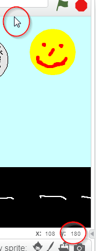

Der kan vi se, at y er 180 oppe i toppen af skærmen! Så lad os sætte møntens y til 180 når vi rammer mønten! Det gør vi med den her brik:

Tag og sæt den i stedet for hvor vi siger hej! Så kommer det til at se sådan ud:

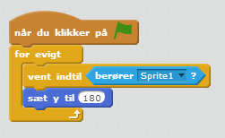

Prøv nu at starte spillet og se hvad der sker!

Det er ikke så spændende hvis den hele tiden falder fra samme sted! Så lad os ændre på møntens x. Den fortæller hvor til venstre og højre mønten er! Vi kan checke x på samme måde som vi checker y. (Lige ved siden af)

Men hvad skal vi så sætte x til? Vi vil jo gerne have den til at komme et nyt sted hver gang?

Vi har heldigvis en brik der lader os vælge et helt tilfældigt tal mellem to andre tal! Den ser sådan ud!

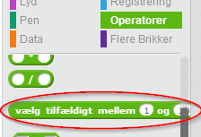

Hvis vi så vælger et tilfældigt tal mellem x på venstre kant, og x på højre kant, så får vi et helt nyt x hver gang!

Hvis vi checker hvad x er på de to kanter på skærmen, så kan vi se at den er -240 i venstre side og 240 i højre side! Lad os så prøve at sætte x til det og se hvad der sker!

Prøv nu at starte spillet! Mønten falder et nyt sted hver gang! Yay!

## Del 6: Gulvet

Nu mangler vi bare at mønten forsvinder når den rammer bunden af skærmen.

Vi ved allerede hvordan man laver noget der checker om vi rør noget. Så, lad os lave en linje der ligger i bunden af skærmen! Det er smart!

### Vejledning

Tryk på tegn-knappen, og lad os tegne en linje

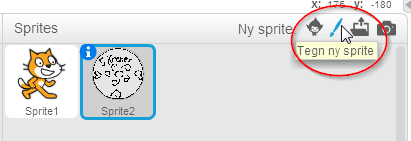

Tryk på "Linje"-knappen for at lave en linje:

Lad os nu lægge linjen i bunden af skærmen, sådan:

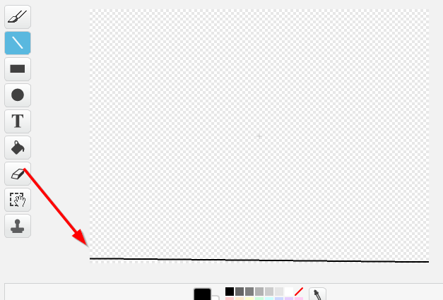

Sådan! Lad os nu gå tilbage til vores kode! Tryk på "Scripts" oppe i toppen af skærmen:

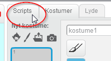

Vi skal nu gå tilbage til mønten. Tryk på mønten nede i vores sprites:

Nu skal vi bare checke om mønten rammer linjen og så flytte den op i toppen af skærmen. Men hov, det er jo det samme der skal ske når den rammer katten! Så lad os starte med at kopiere det der sker når vi rammer katten:

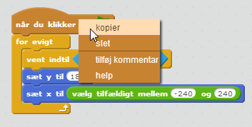

Nu har vi to! Hvordan checker vi nu om vi rammer bunden af skærmen? Jo, vi skal bare checke om vi rammer kanten (Sprite3) i stedet for katten (Sprite1). Sådan!

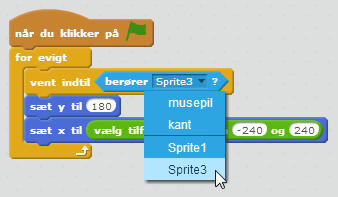

Men hov! Nu virker vores spil jo! Sejt!

Lad dine venner prøve det næste gang de er på besøg. Det kan være de har nogle forslag til hvordan det bliver flottere eller sjovere!

Næste gang vil vi kigge på nogle af de mange udvidelser man kan lave:

 * Point
 * Liv
 * Flere forskellige ting der falder

